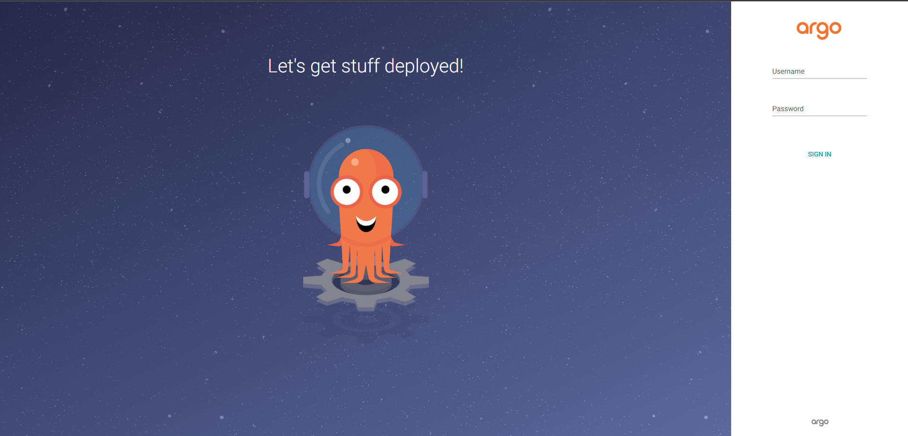
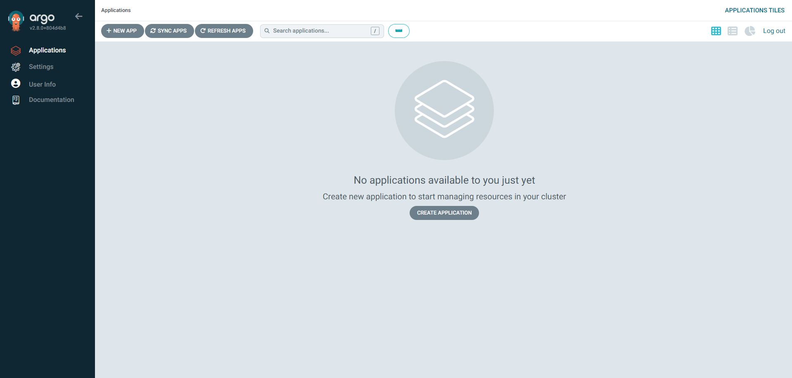

# ArgoCD

構築した Kubernetes クラスタに対して、[ArgoCD](https://argo-cd.readthedocs.io/en/stable/)の設定を行います。

ArgoCD は主に Kubernetes クラスタへの CI/CD パイプラインの構築に使用されます。
ArgoCD を特定の Github リポジトリに接続すると、リポジトリに更新があった場合に更新が自動で Kubernetes クラスタに反映されるようになります。

著者の環境では OpenStack のコントローラーの Kubernetes クラスタへのデプロイを、ArgoCD を使用して行えるようにしました。

## デプロイ

###

まずは`argocd`用の namespace を作成します。

```
kubectl create ns argocd
namespace/argocd created
kubectl get ns
NAME              STATUS   AGE
argocd            Active   3s
default           Active   157m
kube-node-lease   Active   157m
kube-public       Active   157m
kube-system       Active   157m
```

続いて argocd をデプロイします。

```
ARGOCD_VERSION=2.8.0
kubectl apply -n argocd -f https://raw.githubusercontent.com/argoproj/argo-cd/v${ARGOCD_VERSION}/manifests/install.yaml
```

ここで`kubectl get pods -n argocd -o wide`を実行すると、ArgoCD 関連の Pod が起動していることがわかります。

```
kubectl get pods -n argocd -o wide
NAME                                                READY   STATUS    RESTARTS   AGE   IP               NODE   NOMINATED NODE   READINESS GATES
argocd-application-controller-0                     1/1     Running   0          33m   10.233.98.11     cp2    <none>           <none>
argocd-applicationset-controller-5787d44dff-jr7c4   1/1     Running   0          33m   10.233.116.138   cp1    <none>           <none>
argocd-dex-server-858cfd495f-m8pls                  1/1     Running   0          33m   10.233.98.9      cp2    <none>           <none>
argocd-notifications-controller-5d889fdf74-shf9r    1/1     Running   0          33m   10.233.91.8      cp3    <none>           <none>
argocd-redis-7d8d46cc7f-wlgx8                       1/1     Running   0          33m   10.233.98.10     cp2    <none>           <none>
argocd-repo-server-7b6d785784-qz82z                 1/1     Running   0          33m   10.233.91.7      cp3    <none>           <none>
argocd-server-67f667d48c-hb5sw                      1/1     Running   0          33m   10.233.116.139   cp1    <none>           <none>

```

しかしながら、上記の例では Pod がコンピュートノードに展開されてしまっています。
今回はコントローラノード(cr1, cr2, cr3)にのみ Pod を配置したいため、次の手順を実施ます。

まずはコントローラノードにそれぞれ`argocd-node=true`というラベルを付与します。

```
CRs="cr1 cr2 cr3"
for CR in ${CRs}
do
    kubectl label node ${CR} argocd-node=true
done
```

続いて、Pod をスケジューリングしている`Deploymentリソース`と`StatefulSetリソース`に`nodeAffinity`の設定を適用して、`argocd-node=true`を付与したノードにのみ Pod が配置されるようにします。

```
# "argocd-~"という名前のDeploymentにpatchを充てる
for DEPLOY in $(kubectl get deploy -n argocd | awk '{
print $1}' | grep ^argocd-); do
kubectl patch deploy -n argocd ${DEPLOY} -p '{"spec": {"template": {"spec": {"affinity": {"nodeAffinity": {"requiredDuringSchedulingIgnoredDuringExecution": {"nodeSelectorTerms": [{"matchExpressions": [{"key":"argocd-node", "operator":"In", "values": ["true"]}]}]}}}}}}}'; done

# StatefulSet: argocd-application-controllerにPatchを充てる
kubectl patch StatefulSet -n argocd argocd-application-controller -p '{"spec": {"template": {"spec": {"affinity": {"nodeAffinity": {"requiredDuringSchedulingIgnoredDuringExecution": {"nodeSelectorTerms": [{"matchExpressions": [{"key":"argocd-node", "operator":"In", "values": ["true"]}]}]}}}}}}}'
```

時間が立つと、下記のようにコントローラノードに Pod が配置されます。

```
kubectl get pods -n argocd -o wide
NAME                                                READY   STATUS              RESTARTS   AGE   IP              NODE   NOMINATED NODE   READINESS GATES
argocd-application-controller-0                     0/1     ContainerCreating   0          15s   <none>          cr1    <none>           <none>
argocd-applicationset-controller-57666dd6fc-7rrlh   1/1     Running             0          40s   10.233.65.59    cr3    <none>           <none>
argocd-dex-server-b854db4f9-vtvdd                   1/1     Running             0          40s   10.233.66.119   cr2    <none>           <none>
argocd-notifications-controller-7947f48b54-qgxp5    1/1     Running             0          39s   10.233.66.33    cr2    <none>           <none>
argocd-redis-b8494bc67-hbjz2                        1/1     Running             0          40s   10.233.64.189   cr1    <none>           <none>
argocd-repo-server-867dcf5f9b-9hdgs                 1/1     Running             0          40s   10.233.65.254   cr3    <none>           <none>
argocd-server-7476ddbfbc-7lzbj                      1/1     Running             0          40s   10.233.65.4     cr3    <none>           <none>
```

## ルーティング

先ほどデプロイした ArgoCD を外部からアクセスできるようにするため、`argocd-server`のサービスを ClusterIP から LoadBalancer に変更します。

```
kubectl patch svc argocd-server -n argocd -p '{"spec": {"type": "LoadBalancer"}}'
```

適用後少し時間が経つと、`argocd-server`の ExternalIP が設定されます。

ExternalIP は下記のように確認できます。この場合は`10.0.1.201`が割り当てられていることを確認できます。

```
kubectl -n argocd get svc argocd-server -o jsonpath="{.status.loadBalancer.ingress[*].ip}"
10.0.1.201
```

## コマンドラインツールのインストール

続いてコントローラ 1 上で`argocd`コマンドを使用できるようにセットアップします。
下記コマンドを実行してください。

```
VERSION=2.8.0
sudo curl -sSL -o /usr/local/bin/argocd https://github.com/argoproj/argo-cd/releases/download/v${VERSION}/argocd-linux-amd64
sudo chmod +x /usr/local/bin/argocd
echo "$(argocd completion bash)" | sudo tee /etc/bash_completion.d/argocd
```

## ログイン(CUI)

それではデプロイした ArgoCD にログインしてみましょう。

まずは ArgoCD のログインパスワードを確認します。次のコマンドで出力された値がパスワードになります。

```
kubectl -n argocd get secret argocd-initial-admin-secret -o jsonpath="{.data.password}" | base64 -d ; echo
```

では次のコマンドを入力してログインしてみましょう。

```
argocd login 10.0.1.201
```

入力後`username`と`password`について聞かれるので、それぞれ`admin`と先ほど確認したパスワードを入力しましょう。

ログインに成功したら、初期パスワードを任意のものに変更しましょう。次のコマンドでパスワードを変更できます。

```
argocd account update-password
```

## ログイン(WebUI)

ArgoCD には WebUI も備わっています。
ブラウザを開き、https://10.0.1.201 にアクセスしてみてください。


ログイン情報は

- username: admin
- password: 先ほど設定したパスワード

です。正しくログインできた場合、次のような画面が表示されます。



### 参考

- https://www.blog.slow-fire.net/2022/05/24/%E4%BB%8A%E6%9B%B4%E3%81%AA%E3%82%89%E3%81%8Cargo-cd%E3%82%92%E4%BD%BF%E3%81%A3%E3%81%A6%E3%81%BF%E3%81%9F/
